## Book Sharing Application

An Android Application which sets a platform for the book owner or the book borrower which allows to share books among them.

#### Book owner:

1. Create new account 
2. Provide all the information about his book
3. Publish advertisement of the book
4. Recieve Text Message,call or Book borrow Request from the Book Borrower 
5. Lend the Book
6. Recieve Book return Request
7. Get the Book

#### Book Borrower:

1. Sign Up
2. Search for the book using author name,book name etc.
3. Check the book info,Book owner info like address in map, phone number, Security money of the book etc.
4. Contact with the book owner using Chat feature of the app
5. Send book borrow request
6. Get the desired book

#### Technology Stack:

* Firebase Realtime Database
* Firebase Auth
* Firebase Storage
* Firebase Cloud Messaging (FCM)
* Firebase Cloud Function
* Google Map Api
* Google Places Api
* Navigation Component
* Data Binding

#### Screenshots :

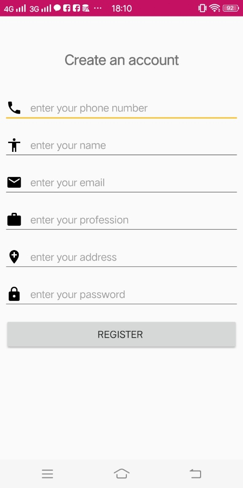  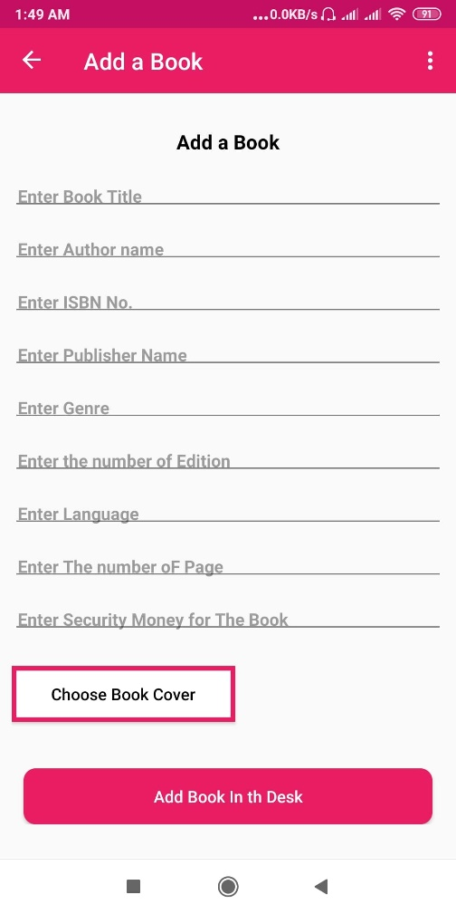 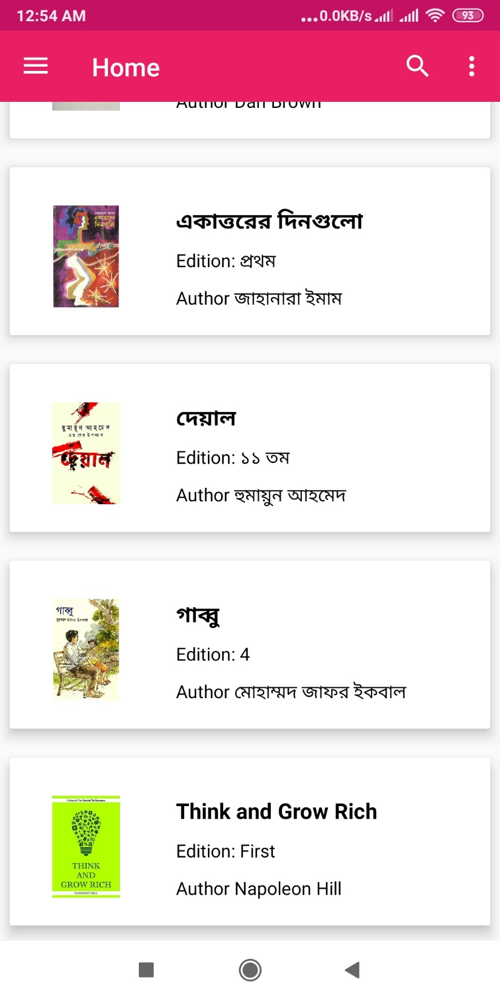

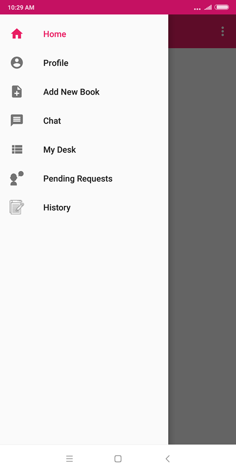 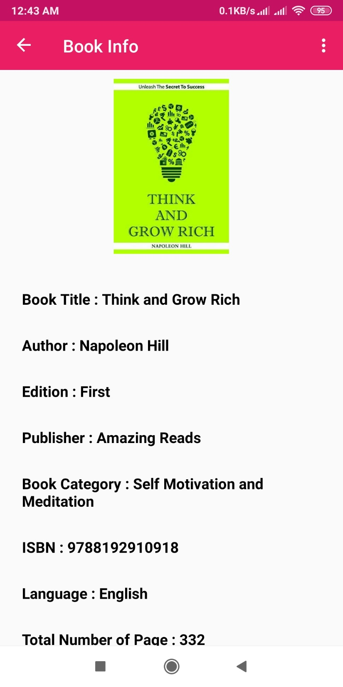 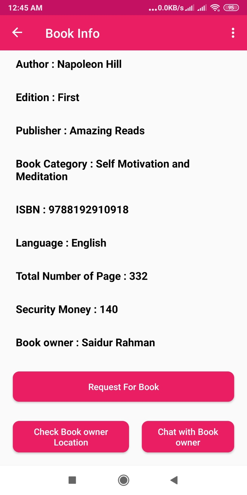 

  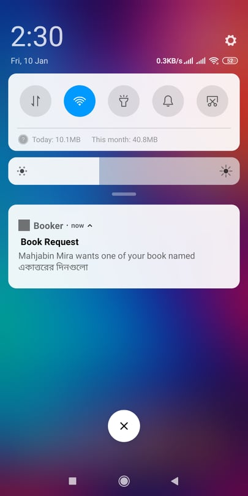 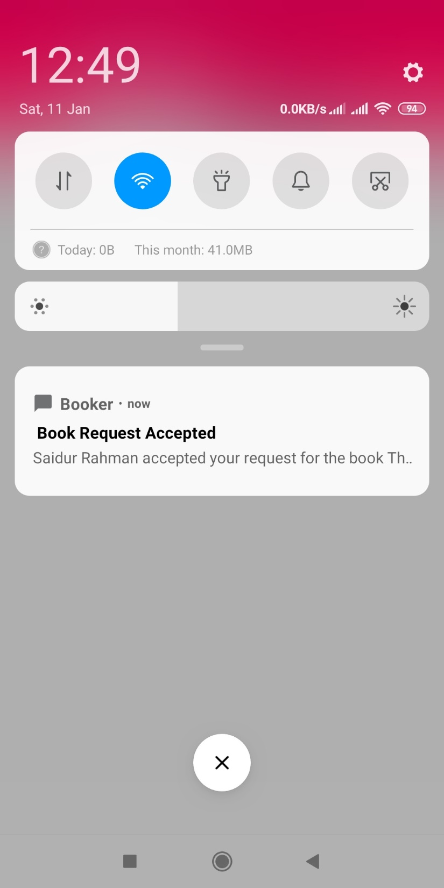

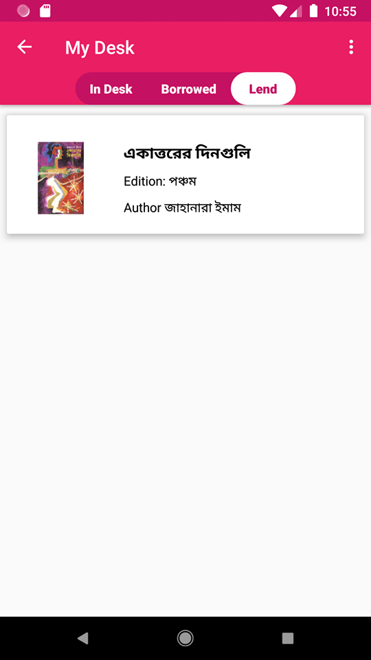 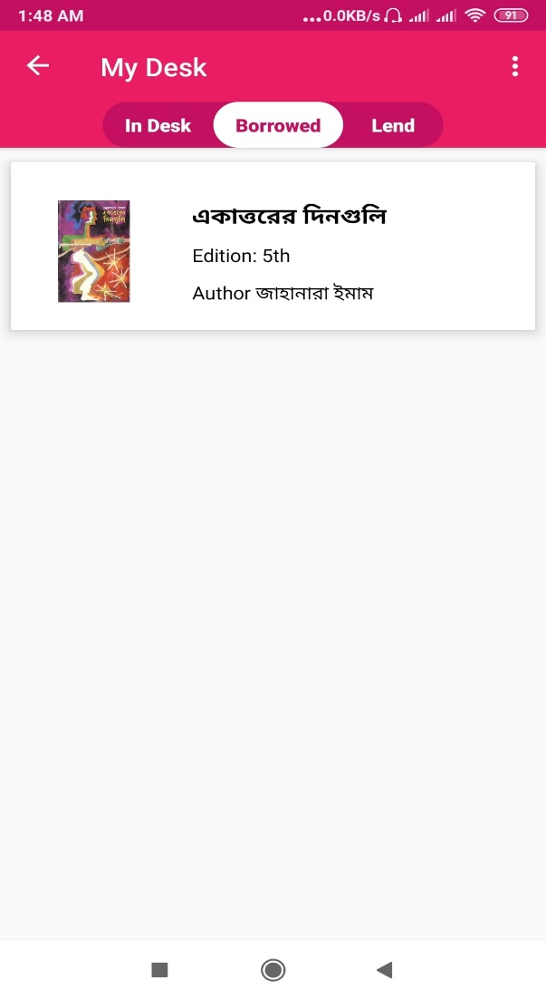 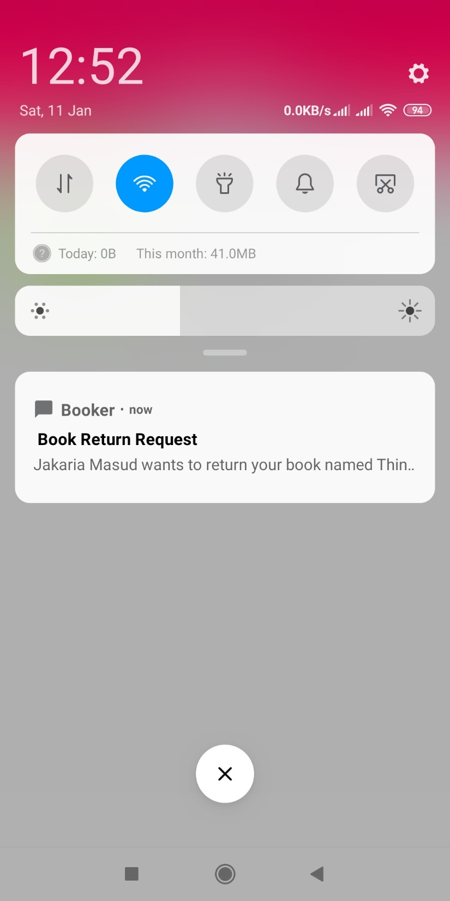 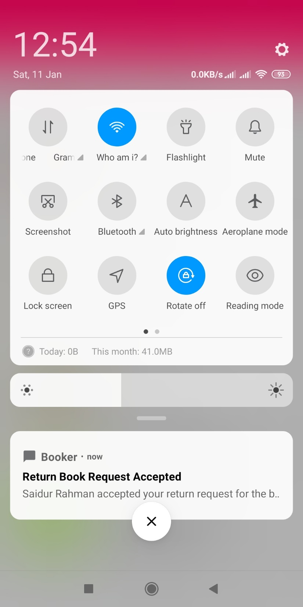

 
 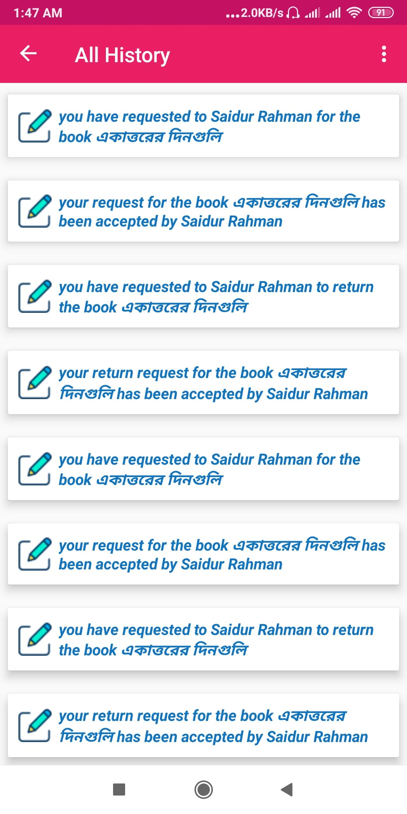